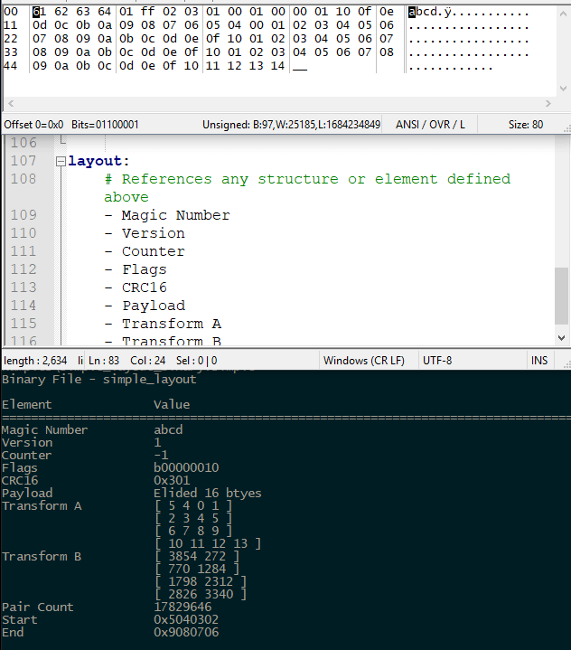

# Bender
A YAML driven binary file viewer

This program reads in a binary file specification written in YAML and emits neat, formatted data to your console.

1) Define your YAML spec
2) Feed YAML spec and a binary to Bender
3) Save a few brain cycles analyzing the binary



## YAML Definition
| Name | Default Value | Description |
|:-----|:--------------|:------------|
| format | bender.v1 | Version of this specification |
| name | _empty_ | Human friendly name of your spec |
| extensions | _empty_ | List of extensions associated with the file you are describing |
| base_element | Default Values for each type in Element | The default element for your spec |
| structures | _empty_ | Complex data types, e.g. structs |
| elements | _empty_ | Named definition of data in your binary |
| layout | _empty_ | Ordered list of elements as they are expected to be found in a binary. |

### Element Object
The fundamental component of Bender is the element. This is the name we use to describe one or more bytes in a binary 
file. It has a collection of fields that control how the bytes are read, stored, and displayed. Elements can be 
immediate values (e.g. the current read position) or deferred objects. In the latter case, a deferred object is a marker
of 8 bytes describing the offset and size of the real data, each of which are 4 bytes in width.

You may take advantage of YAML merge keys to generate base objects from which you can build your elements.

| Field | Description | Legal Values |
|:------|:------------|:-------------|
| name | Name to display for this element | strings |
| elide | Hide this element from display | YAML bool |
| units | How many bytes are in this element | A positive integer |
| signed | Represent bytes as a signed value | YAML bool |
| format | How the bytes should be interpreted | binary, octal, decimal, hex, ascii, utf16, hexstr, single, double |
| little_endian | What order the bytes are stored in the file | YAML bool |
| is_deferred | True if this object is a deferral | Optionally specify that this element is a pointer to more data |
| is_array_count| True if this value is a count of the next object | Optionally hint that the next object is repeated N times |
| matrix | Optional matrix definition | Defines the shape of the data as a matrix type |

### Deferred Object
Sometimes your binary has dynamic data. We can still parse it by using a deferred definition. Using this approach, you 
are defining a contract that gives an offset (relative to the start of the file) and a size in bytes of future data. 
Once all the elements have been read, the deferred data types are processed according to your spec.

This pattern is based on the technique of inserting a marker in your binary that is effectively a custom pointer. Both 
the size and offset must be 4-byte values. There are no plans to support alternative integer sizes for these values.

```
typedef def_location_t {
	uint32_t offset;
	uint32_t size;
};
```

### Matrix Object
A matrix element is a definition for representing your data as a matrix. When a matrix is detected by the Bender parser, 
the format of the parent element controls the representation of the bytes. For deferred objects, the total size is 
captured from the 4-byte size definition which is used to calculate the total row count. For immediate objects,
the element's units field is used to determine the total size.

| Field | Description | Legal Values |
|:------|:------------|:-------------|
| columns | How many variables per row | A positive integer |
| units | How many bytes per variable | A positive integer |


### Structure Object
Sometimes your data is more than just a number or a matrix. Use structures to define sequences of bytes that create more 
complicated data types. Each element may also contain structures, matrices, and can be a mix of deferred and immediate 
objects.

| Field | Description | Legal Values |
|:------|:------------|:-------------|
| name  | Name referenced by and element | strings |
| elements | A list of elements contained in this structure | Any valid Element listed under structure_elements |


